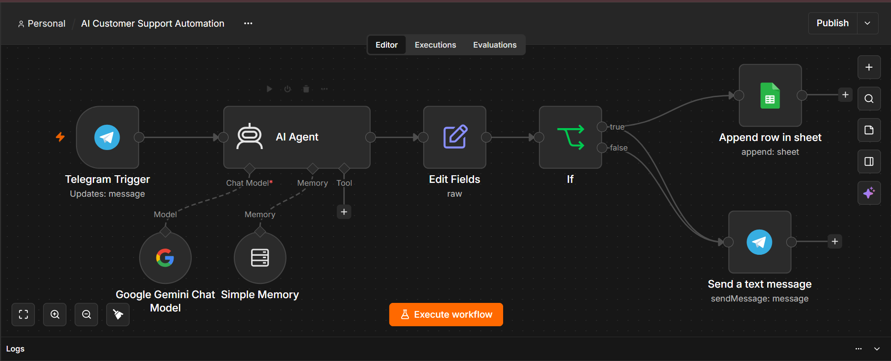
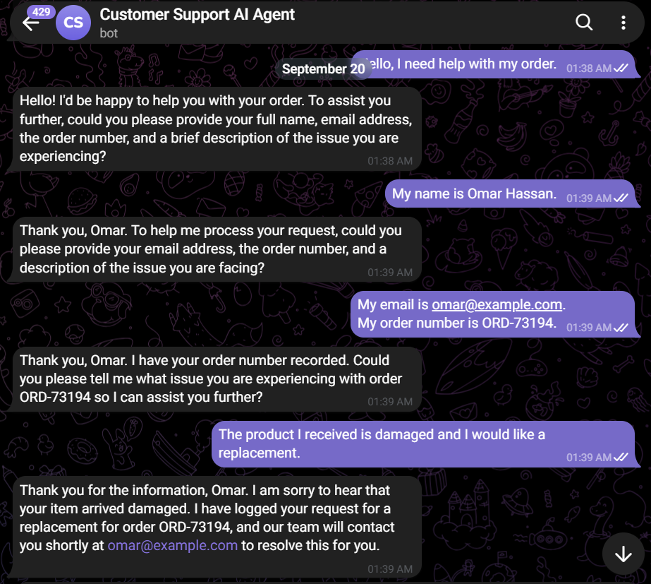
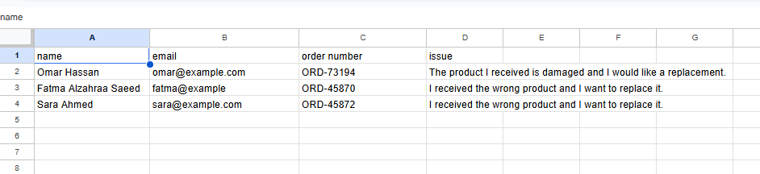

# Telegram AI Customer Support Agent 🤖

An AI-powered customer support automation workflow built with **n8n** and **Google Gemini**.

The system receives customer messages through Telegram, processes them using an AI Agent, maintains conversational context with Simple Memory, manages customer information, and automatically sends responses back to the customer.

## ✨ Features

* 📱 Telegram Trigger for receiving customer messages
* 🤖 AI Agent for understanding customer requests
* 🧠 Google Gemini for AI-powered responses
* 💾 Simple Memory for maintaining conversation context
* ✏️ Edit Fields for processing incoming data
* 📊 Google Sheets for customer data management
* 💬 Automated Telegram text responses
* 🔄 End-to-end workflow automation

## 🔄 Workflow

```text
Customer Message
       ↓
Telegram Trigger
       ↓
Edit Fields
       ↓
AI Agent
   ↙       ↘
Gemini    Simple Memory
       ↓
Process Customer Request
       ↓
Google Sheets
       ↓
Send Telegram Message
       ↓
Customer Response
```

## 🛠️ Technologies & Tools

* **n8n** — Workflow automation
* **Google Gemini** — AI model
* **Telegram Bot** — Customer interaction
* **AI Agent** — Request processing and response generation
* **Simple Memory** — Conversation context
* **Google Sheets** — Customer data management

## 💬 How It Works

1. A customer sends a message through Telegram.
2. The Telegram Trigger receives the message.
3. The incoming data is processed using Edit Fields.
4. The AI Agent analyzes the customer's request.
5. Google Gemini generates the appropriate response.
6. Simple Memory maintains the conversation context.
7. Customer information can be stored and managed through Google Sheets.
8. The generated response is sent back to the customer through Telegram.

## 📸 Workflow & Demo

### 🔄 n8n Workflow



The complete n8n automation connecting Telegram, the AI Agent, Gemini, Simple Memory, Google Sheets, and the response workflow.

### 💬 Telegram Customer Interaction



Example of the AI customer support agent receiving and responding to a customer message through Telegram.

### 📊 Google Sheets



Example of customer information being stored and managed through Google Sheets.

## 🚀 Setup

1. Install or access an n8n instance.
2. Import `telegram-ai-customer-support-agent.json`.
3. Configure your own Telegram Bot credentials.
4. Configure your Google Gemini credentials.
5. Connect your Google Sheets account.
6. Review the AI Agent instructions and workflow settings.
7. Activate the workflow.
8. Send a test message through Telegram.

> **Note:** API keys, credentials, bot tokens, and private customer information are not included in this repository. You must configure your own credentials before running the workflow.

## 🎯 Project Goal

This project demonstrates how **AI Agents, conversational memory, Telegram, Google Sheets, and workflow automation** can be combined to create an automated customer support system.

## 👩‍💻 Built With

**n8n + Google Gemini + Telegram + Google Sheets + Simple Memory + AI Agent**
